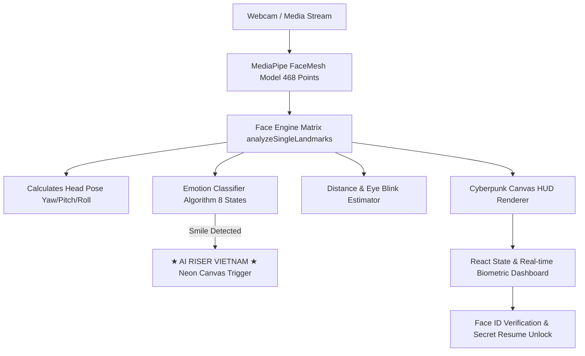

<p align="center">
  
</p>

<h1 align="center">⚡ AI RISER — Vision AI & Developer Portfolio Platform ⚡</h1>

<p align="center">
  <b>Hệ thống Nhận diện Sinh trắc học Khuôn mặt Real-time & Hồ sơ Năng lực Lập trình viên Dark Cinematic</b>
</p>

<p align="center">
  <a href="https://github.com/wane-bs/ai-riser">
    
  </a>
  <a href="https://github.com/wane-bs/ai-riser/blob/main/LICENSE">
    
  </a>
  
  
  
  
</p>

---

## 🌟 Giới Thiệu Dự Án (Overview)

**AI RISER** là ứng dụng Web đa năng kết hợp giữa **Giao diện Hero Landing Dark Cinematic (Nexum AI-Ops Style)** và **Mini App Nhận diện Sinh trắc học Khuôn mặt Thời gian thực (Real-time Vision AI Engine)**.

Ứng dụng cho phép phân tích **468 điểm tọa độ 3D (FaceMesh)** trực tiếp tại trình duyệt bằng công nghệ Client-side WebGL/Canvas (100% Zero-Trust Privacy Boundary), nhận diện **8 cảm xúc vi mô**, đo lường góc quay đầu (Yaw/Pitch/Roll), và kích hoạt huy hiệu độc quyền **`★ AI RISER VIETNAM ★`** khi người dùng mỉm cười.

---

## ✨ Tính Năng Nổi Bật (Key Features)

### 1. 🎬 Dark Cinematic Hero Landing Page
- **Full-bleed Background Video**: Video cinema chất lượng cao chạy nền tự động.
- **Glassmorphism Design System**: Các thẻ kính mờ cao cấp với hiệu ứng ánh kim Cyan/Emerald.
- **Typography Chuẩn hóa**: Sự kết hợp giữa phông chữ `Geist` và phông `Silkscreen` độc quyền cho con số chỉ số **`"42,500+"`**.

### 2. 👁️ Real-time Vision AI & Emotion Engine
- **468 3D Mesh Vertices**: Theo dõi và dựng lưới tọa độ khuôn mặt chuẩn xác đến từng milimet.
- **Bộ 8 Cảm xúc Vi mô (Universal Emotion Suite)**:
  - 🟢 **Cười (Happy 😄)** -> *Kích hoạt Trigger Huy hiệu Neon `★ AI RISER VIETNAM ★`*
  - 🔵 **Buồn (Sad 😢)**
  - 🔴 **Tức giận (Angry 😡)**
  - 🟡 **Ngạc nhiên (Surprised 😲)**
  - 🟣 **Sợ hãi (Fear 😱)**
  - 🟢 **Khó chịu / Chán ghét (Disgust 🤢)**
  - 🔷 **Tập trung (Focused 🧐)**
  - 💎 **Bình thường (Neutral 😐)**
- **Chỉ số Sinh trắc học (Biometric Telemetry)**: Đo góc xoay đầu (Head Pose Yaw/Pitch/Roll), khoảng cách tới Camera (cm), tần suất chớp mắt (Blink rate).

### 3. 🔒 Face ID Verification & Secret Resume
- Mô phỏng quy trình quét sinh trắc học Face ID Scanner. Khi hoàn tất xác thực thành công, hệ thống sẽ mở khóa tài liệu **Sơ yếu Lý lịch Bảo mật (Secret Resume)** và các thông tin dự án ẩn của **Mr.Híu**.

### 4. 💻 Interactive AI CLI Terminal
- Cửa sổ dòng lệnh mô phỏng cho phép người dùng gõ lệnh tương tác: `bio`, `skills`, `contact`, `scan`, `clear`.

---

## 🛠️ Kiến Trúc Hệ Thống (System Architecture)



---

## 📂 Cấu Trúc Thư Mục Project (Project Structure)

```text
ai-riser/
├── .agents/                    # Agent Customization Skills & Instructions
├── public/                     # Static Public Assets
├── src/
│   ├── components/
│   │   ├── Navbar.tsx          # Glassmorphism Top Navigation Bar
│   │   ├── HeroSection.tsx     # Dark Cinematic Hero Page (Nexum Video Background)
│   │   ├── FaceRecognitionApp.tsx # Vision AI Canvas & Emotion Dashboard
│   │   ├── PortfolioSection.tsx   # Developer Skills Grid & Secret Resume
│   │   ├── TerminalBio.tsx     # Cyberpunk CLI Terminal Interactive Shell
│   │   └── Footer.tsx          # System Status Footer
│   ├── types/
│   │   └── face.ts             # TypeScript Type Interfaces
│   ├── utils/
│   │   └── faceEngine.ts       # 468 Point FaceMesh Renderer & Emotion Engine
│   ├── App.tsx                 # Root React Component
│   ├── main.tsx                # Entrypoint
│   └── index.css               # Global CSS & Glassmorphism Utilities
├── index.html                  # HTML Shell + Google Fonts + MediaPipe CDN
├── tailwind.config.js          # Tailwind Configuration
├── tsconfig.json               # TypeScript Configuration
├── vite.config.ts              # Vite Bundler Configuration
└── README.md                   # Project Documentation
```

---

## 🚀 Hướng Dẫn Cài Đặt & Khởi Chạy (Quick Start)

### 1. Yêu cầu hệ thống
- **Node.js**: `v18.0.0` trở lên
- **npm**: `v9.0.0` trở lên

### 2. Cài đặt Dependencies
```bash
# Clone repository
git clone https://github.com/wane-bs/ai-riser.git
cd ai-riser

# Cài đặt thư viện
npm install
```

### 3. Khởi chạy Môi trường Phát triển (Development)
```bash
npm run dev
```
Trình duyệt sẽ tự động mở ứng dụng tại địa chỉ: `http://localhost:3000`

### 4. Đóng gói Sản phẩm (Production Build)
```bash
npm run build
```
Mã nguồn sản phẩm sau khi đóng gói sẽ nằm trong thư mục `/dist`.

---

## 👤 Tác Giả & Bản Quyền (Author & License)

- **Tác giả**: **Nguyễn Trung Hiếu** (Analyst Engineer) -Open for work-
- **Repository**: [https://github.com/wane-bs/ai-riser](https://github.com/wane-bs/ai-riser)
- **License**: Phát hành theo giấy phép [MIT License](LICENSE).

<p align="center">
  Developed with ❤️ for <b>AI RISER VIETNAM</b>
</p>
